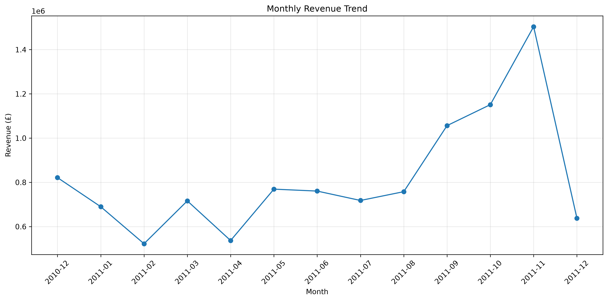
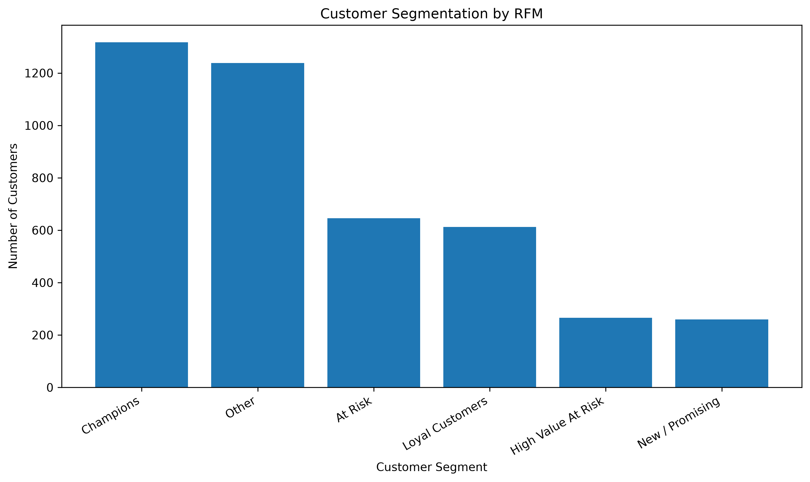
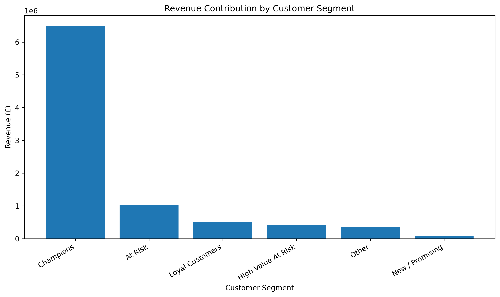

# E-Commerce Customer & Sales Intelligence Platform

A data analytics and business intelligence project that analyzes e-commerce transactions to uncover revenue trends,customer behavior,product performance,and customer segments using Python,Pandas,SQL,and Power BI.

## Dashboard Preview

### Sales & Customer Insights



### Customer Analysis





---

## Project Overview

This project transforms raw e-commerce transaction data into actionable business insights.

The analysis covers:

- Revenue and order performance
- Monthly sales trends
- Product performance
- Country-level revenue
- Customer purchasing behavior
- Repeat customer analysis
- Customer lifetime value indicators
- RFM-based customer segmentation
- Interactive Power BI dashboards

The project demonstrates an end-to-end analytics workflow starting from raw transactional data and ending with a business intelligence dashboard.

---

## Business Objectives

The main objectives of this project are to:

1. Understand overall sales and revenue performance.
2. Identify high-performing products and markets.
3. Analyze customer purchasing frequency and spending behavior.
4. Identify high-value and at-risk customer segments.
5. Build an interactive dashboard for business decision-making.
6. Create a reproducible data-cleaning and analysis workflow.

---

## Dataset

The project uses the **Online Retail** dataset containing transactional data from a UK-based online retailer.

The dataset contains approximately **541,909 original transactions** and includes fields such as:

| Column | Description |
|---|---|
| InvoiceNo | Transaction/invoice number |
| StockCode | Product code |
| Description | Product description |
| Quantity | Number of units purchased |
| InvoiceDate | Transaction date and time |
| UnitPrice | Price per unit |
| CustomerID | Unique customer identifier |
| Country | Customer country |

The original dataset is not included in the GitHub repository because of its size.

Dataset source:

**UCI Machine Learning Repository — Online Retail Dataset**

---

## Technology Stack

### Programming & Data Analysis

- Python
- Pandas
- NumPy
- Matplotlib
- Seaborn
- Jupyter Notebook

### Database & Querying

- SQL
- PostgreSQL

### Business Intelligence

- Microsoft Power BI
- Power Query
- DAX
- Data Modeling

### Development Tools

- VS Code
- Git
- GitHub

---

## Project Workflow

```text
Raw Transaction Data
        |
        v
Data Quality Analysis
        |
        v
Data Cleaning
        |
        v
Exploratory Data Analysis
        |
        +------------------+
        |                  |
        v                  v
Sales Analysis       Customer Analysis
        |                  |
        |                  v
        |            RFM Segmentation
        |                  |
        +---------+--------+
                  |
                  v
          Power BI Dashboard
                  |
                  v
        Business Insights

## Business Problem

E-commerce businesses generate large volumes of transactional data,but raw transaction records alone do not provide clear business insights.

This project addresses several practical business questions:

- How much revenue is being generated over time?
- Which products contribute the most revenue?
- Which countries generate the highest revenue?
- Who are the highest-value customers?
- Which customers purchase most frequently?
- Which customers are loyal,and which may require retention efforts?
- How can customer behavior be converted into actionable segments?
- How can these insights be presented through an interactive dashboard?

---

## Key Performance Indicators

The analysis produced the following core business KPIs:

| Metric | Result |
|---|---:|
| Total Revenue | £10.64M |
| Total Orders | 19,960 |
| Identifiable Customers | 4,338 |
| Unique Products | 3,922 |
| Countries | 38 |
| Average Order Value | £533.17 |
| Valid Transactions After Cleaning | 524,878 |

These KPIs provide a high-level view of the company's sales and customer activity.

---

## Data Quality Analysis

The original dataset contained **541,909 transaction records**.

The initial data-quality assessment identified:

- 1,454 records with missing product descriptions
- 135,080 records with missing Customer IDs
- 5,268 duplicate records
- 9,288 cancelled transactions
- 10,624 transactions with non-positive quantities
- 2,517 transactions with non-positive unit prices

The analysis separated data-quality issues from legitimate missing customer identifiers.

Transactions without a `CustomerID` were retained for overall sales analysis because they still contain useful transaction-level information.

For customer-level analysis,only records with a valid `CustomerID` were used.

---

## Data Cleaning Process

The following rules were applied to create the analytical dataset:

```text
Original Dataset
      |
      v
Remove Cancelled Invoices
      |
      v
Remove Invalid Quantities
      |
      v
Remove Invalid Unit Prices
      |
      v
Remove Duplicate Records
      |
      v
Create Revenue Column
      |
      v
Clean Analytical Dataset
